# device_systems - API REST v2.0.0

## Descripción
Evolución de la API REST **device_systems** desarrollada en FastAPI. Implementa el CRUD completo del recurso users, separación de responsabilidades en 5 capas, manejo profesional de excepciones HTTP, inyección de dependencias con Depends() y documentación interactiva bajo estándar OpenAPI.

## Tecnologías Utilizadas
- Python 3.11+
- FastAPI
- Uvicorn
- Pydantic v2

## Instalación de Dependencias

1. Clonar el repositorio:
   ```bash
   git clone [https://github.com/luisdavidherreraarroyom-ops/device_systems.git](https://github.com/luisdavidherreraarroyom-ops/device_systems.git)
   cd device_systems

   python -m venv .venv
# En Windows PowerShell:
.\.venv\Scripts\Activate.ps1

# Instalar dependencias:
pip install -r requirements.txt

# Comando para Ejecutar el Servidor
python -m uvicorn app.main:app --reload

# Acceso a la documentación interactiva:

Swagger UI: http://127.0.0.1:8000/docs

ReDoc: http://127.0.0.1:8000/redoc

## Tabla de Endpoints

| Método | Ruta | Descripción | Estado Exitoso |
| :--- | :--- | :--- | :--- |
| `GET` | `/users` | Obtener la lista completa de usuarios | `200 OK` |
| `GET` | `/users/{user_id}` | Obtener un usuario por su ID | `200 OK` |
| `POST` | `/users` | Crear un nuevo usuario | `201 Created` |
| `PUT` | `/users/{user_id}` | Actualizar un usuario completamente | `200 OK` |
| `PATCH` | `/users/{user_id}` | Actualizar parcialmente un usuario | `200 OK` |
| `DELETE` | `/users/{user_id}` | Eliminar un usuario por su ID | `200 OK` |

# Ejemplos de Peticiones y Respuestas

Crear Usuario (POST /users)
Request Body:

JSON
{
  "name": "Carlos Gomez",
  "email": "carlos@example.com",
  "role": "developer",
  "is_active": true
}
Response (201 Created):

JSON
{
  "name": "Carlos Gomez",
  "email": "carlos@example.com",
  "role": "developer",
  "is_active": true,
  "id": 3
}

# Códigos de Estado Usados

200 OK: Petición procesada correctamente.

201 Created: Recurso creado con éxito.

400 Bad Request: Datos de entrada inválidos de negocio (email duplicado, PATCH vacío).

404 Not Found: El usuario solicitado no existe en el sistema.

422 Unprocessable Entity: Error de validación en la estructura del JSON por parte de Pydantic.


# Explicación del Uso de Depends()

Se utiliza Depends() para aplicar el principio de inyección de dependencias de FastAPI. Permite desacoplar las rutas del manejo directo de la base de datos o lógica de negocio, inyectando las instancias de los servicios de manera transparente, testeable y mantenible.


# Explicación del Manejo de Errores

El sistema utiliza excepciones personalizadas capturadas mediante la clase HTTPException de FastAPI. Cuando ocurre un fallo de negocio (como intentar registrar un correo repetido o consultar un ID que no existe), el servicio interrumpe el flujo y retorna una respuesta JSON estructurada con el código HTTP correspondiente.


## Evidencias de Funcionamiento

### Documentación
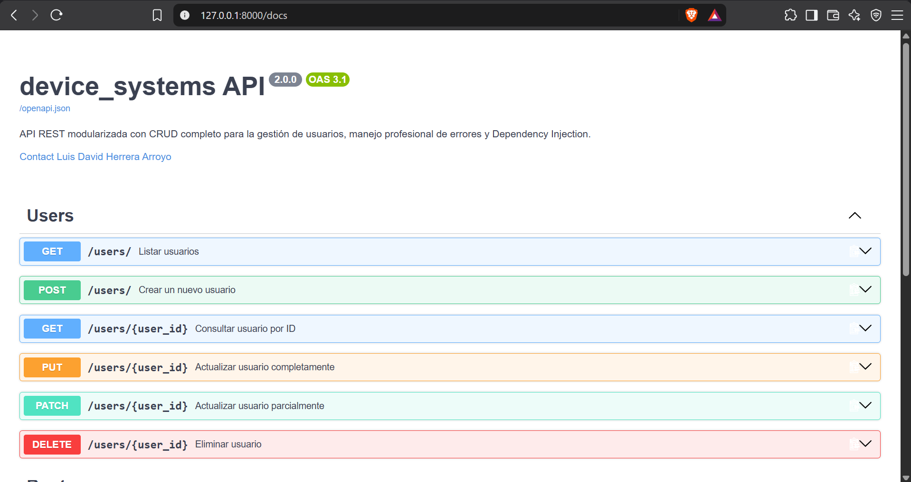
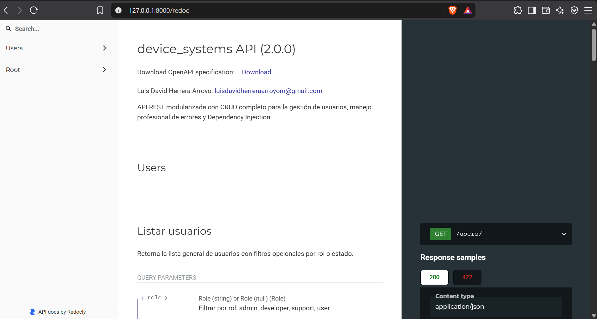

### Endpoints CRUD

* **Listar Usuarios:** 
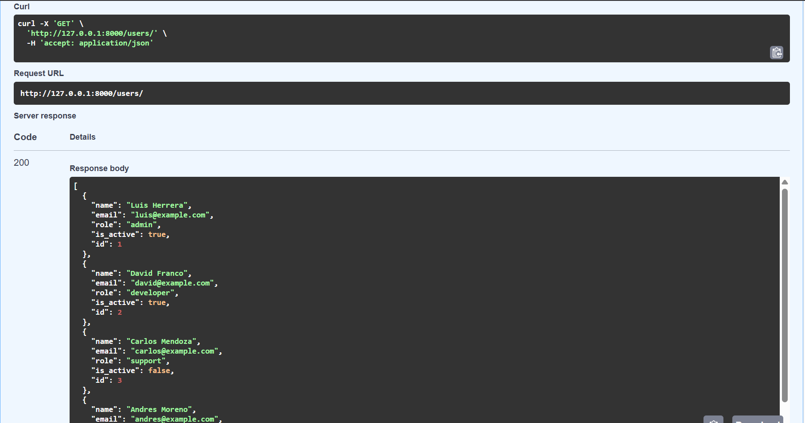

* **Obtener Usuario:** 
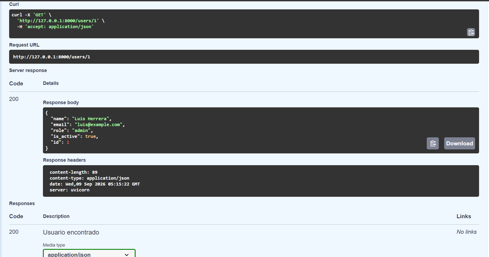

* **Crear Usuario:** 
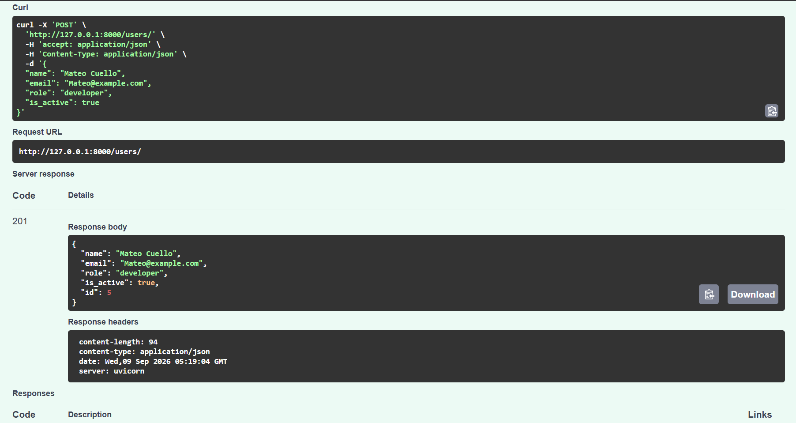

* **Actualizar Usuario:** 
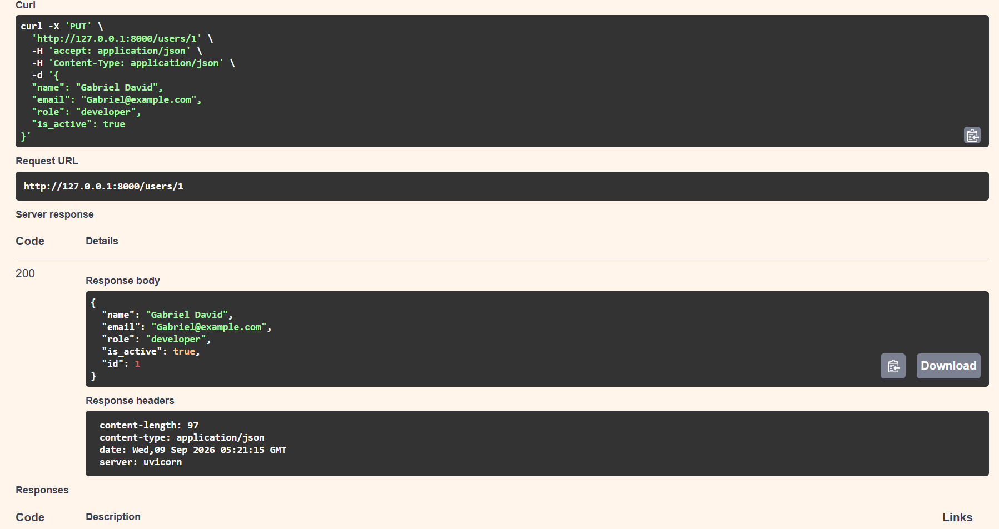

* **Actualizar Parcial:** 
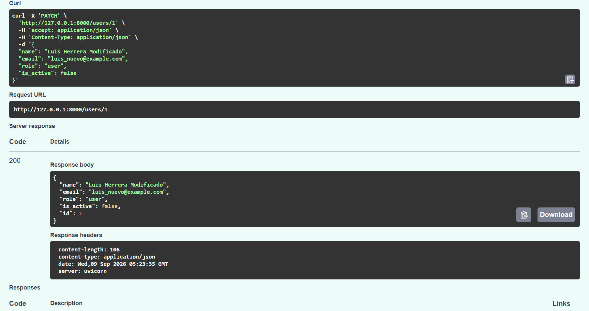

* **Eliminar Usuario:** 
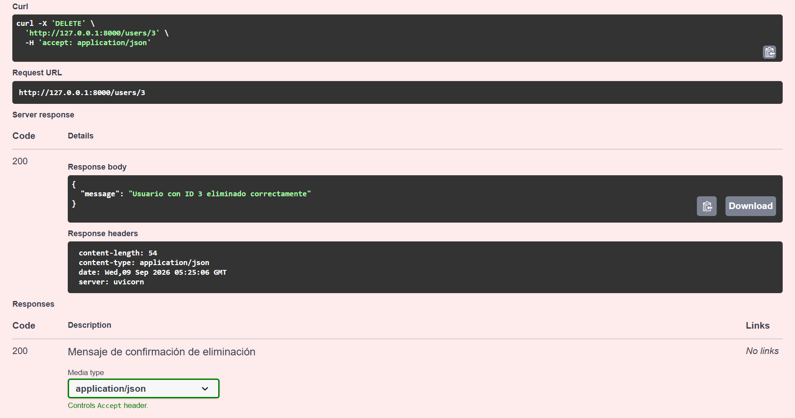

### Errores Controlados

* **404 Not Found:** 
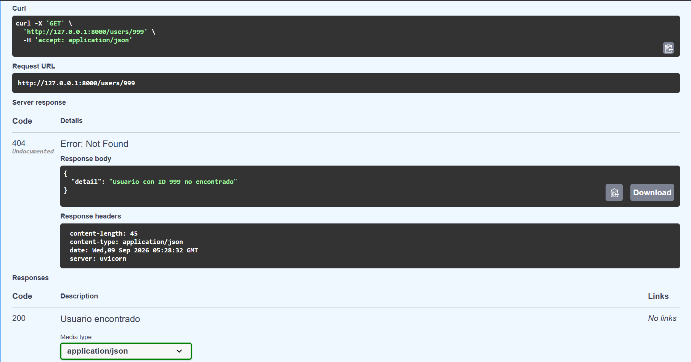

* **400 Correo Duplicado:** 
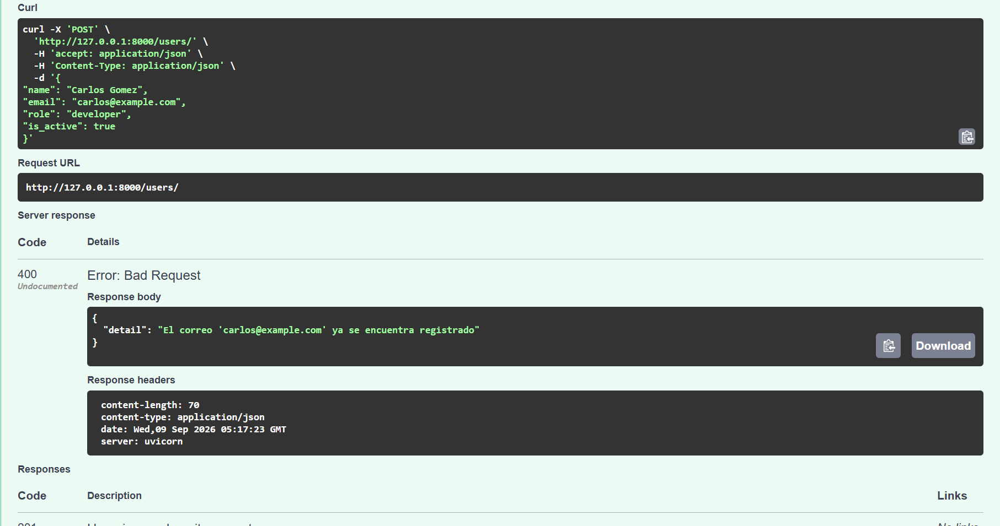

* **400 Body Vacío:** 
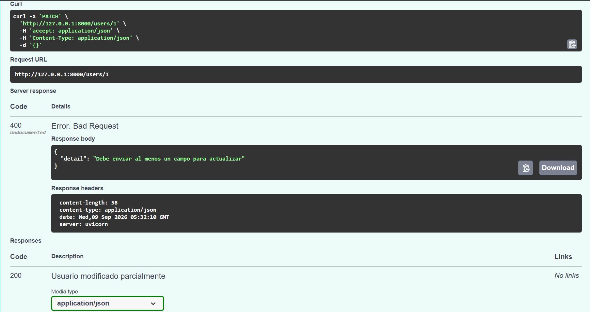

* **422 Validation Error:** 
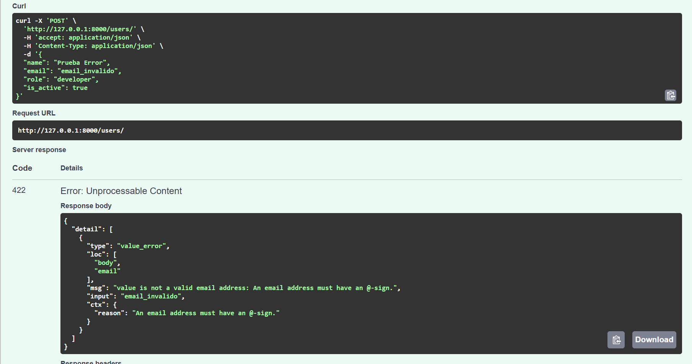