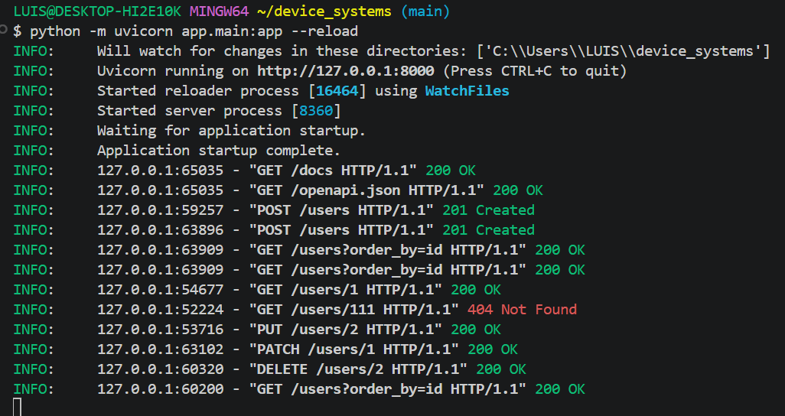

# Device Systems API - Migración a SQLite y SQLAlchemy
Evidencia: GA1-220501096-01-AA1-EV09 – FastAPI con SQLAlchemy: Persistencia de Datos y CRUD sobre Base de Datos en device_systems
Desarrollado por: Luis David Herrera Arroyo  
Tecnologías principales: FastAPI, SQLAlchemy, SQLite, Pydantic v2

Descripción del Proyecto.

Este proyecto consiste en la evolución y migración de la API REST device_systems, pasando de una arquitectura basada en almacenamiento en memoria a una persistencia relacional permanente en base de datos SQLite, utilizando SQLAlchemy como ORM (Object-Relational Mapping).

El sistema gestiona registros de usuarios permitiendo operaciones CRUD completas, filtrados avanzados, ordenamiento y validación estricta de tipos de datos.


🏗️ Arquitectura del Proyecto.

El proyecto está estructurado bajo una arquitectura limpia en capas para facilitar el mantenimiento y la escalabilidad:

```text
device_systems/
│
├── app/
│   ├── database/                  # Capa 1: Conexión (connection.py)
│   ├── dependencies/              # Capa 2: Inyección (database_dependency.py)
│   ├── models/                    # Capa 3: Modelos ORM (user_model.py)
│   ├── schemas/                   # Capa 4: Schemas DTO (user_schema.py)
│   ├── services/                  # Capa 5: Lógica CRUD (user_service.py)
│   ├── routes/                    # Controladores REST (user_routes.py)
│   └── main.py                    # Punto de entrada
│
├── .venv/                         # Entorno virtual
├── device_systems.db              # Base de datos SQLite
├── requirements.txt               # Dependencias del proyecto
└── README.md                      # Documentación
```


Requisitos e Instalación.

Prerrequisitos
- Python 3.10+ (Probado y validado en Python 3.14)
- Git Bash o PowerShell


Pasos de Instalación

Clonar el repositorio:
Bash
- git clone 
- cd device_systems

Crear y activar el entorno virtual:
PowerShell
- python -m venv .venv
- .\.venv\Scripts\Activate.ps1

Instalar dependencias:
PowerShell
- python -m pip install -r requirements.txt


Ejecución del Servidor

Para iniciar la aplicación en modo de desarrollo con recarga automática:
PowerShell
- python -m uvicorn app.main:app --reload


Al arrancar por primera vez, la aplicación creará automáticamente la base de datos device_systems.db en la raíz del proyecto.

Accede a la documentación interactiva en tu navegador:
- Swagger UI: http://127.0.0.1:8000/docs
- ReDoc: http://127.0.0.1:8000/redoc


## Documentación de los Endpoints (API REST)

| Método | Endpoint | Descripción | Código Éxito |
| :--- | :--- | :--- | :--- |
| **GET** | `/users` | Obtiene la lista general con filtros opcionales (`role`, `is_active`, `order_by`) | `200 OK` |
| **GET** | `/users/{id}` | Obtiene los detalles de un usuario específico por su ID | `200 OK` |
| **POST** | `/users` | Registra un nuevo usuario en la base de datos | `201 Created` |
| **PUT** | `/users/{id}` | Actualiza completamente los datos de un usuario | `200 OK` |
| **PATCH** | `/users/{id}` | Actualiza parcialmente uno o más campos de un usuario | `200 OK` |
| **DELETE** | `/users/{id}` | Elimina físicamente un usuario de la base de datos | `200 OK` |


Ejemplos de Peticiones (JSON)

1. Creación de Usuario (POST /users)
JSON
{
  "name": "Luis Herrera",
  "email": "luis@ejemplo.com",
  "role": "admin",
  "is_active": true
}

2. Respuesta Exitosa (201 Created)
JSON
{
  "id": 1,
  "name": "Luis Herrera",
  "email": "luis@ejemplo.com",
  "role": "admin",
  "is_active": true,
  "created_at": "2026-09-12T21:20:00"
}

3. Actualización Parcial (PATCH /users/1)
JSON
{
  "is_active": false
}


Control de Errores e Integridad

- Validación de correos únicos: Retorna error HTTP 400 Bad Request si se intenta registrar un email existente.

- Manejo de registros no encontrados: Retorna HTTP 404 Not Found al buscar o modificar IDs inexistentes.

- Cierre de conexiones: Implementado mediante el patrón de inyección get_db con bloque finally: db.close() para evitar bloqueos en SQLite.


servidor corriendo en la terminal


Interfaz de Swagger UI 


Prueba de la petición POST /users exitosa (201 Created)


