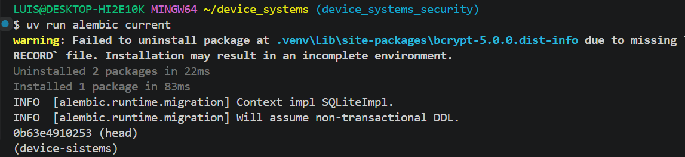
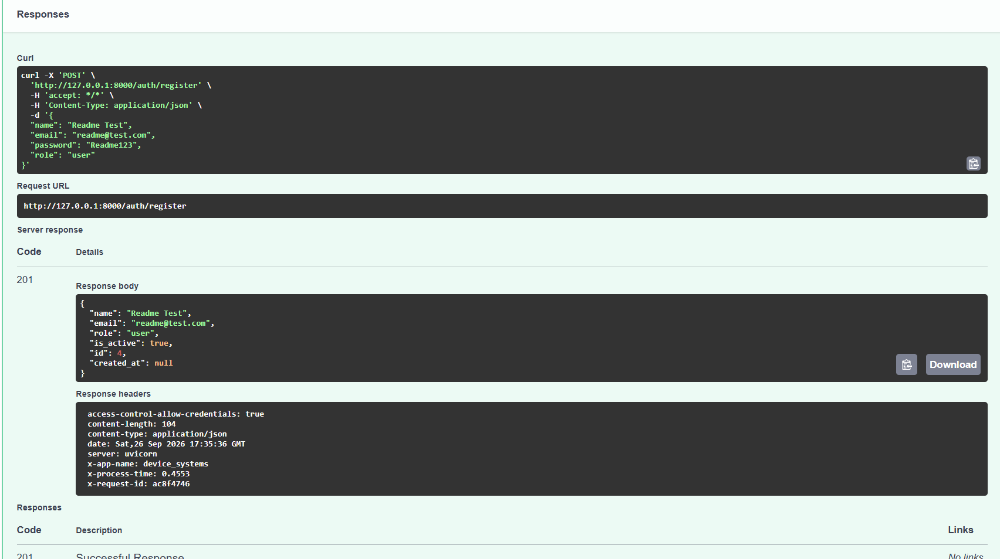
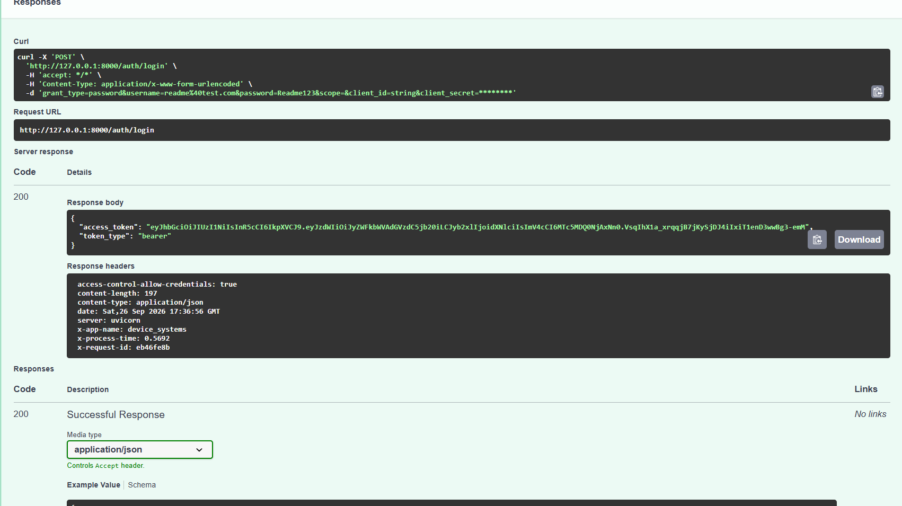
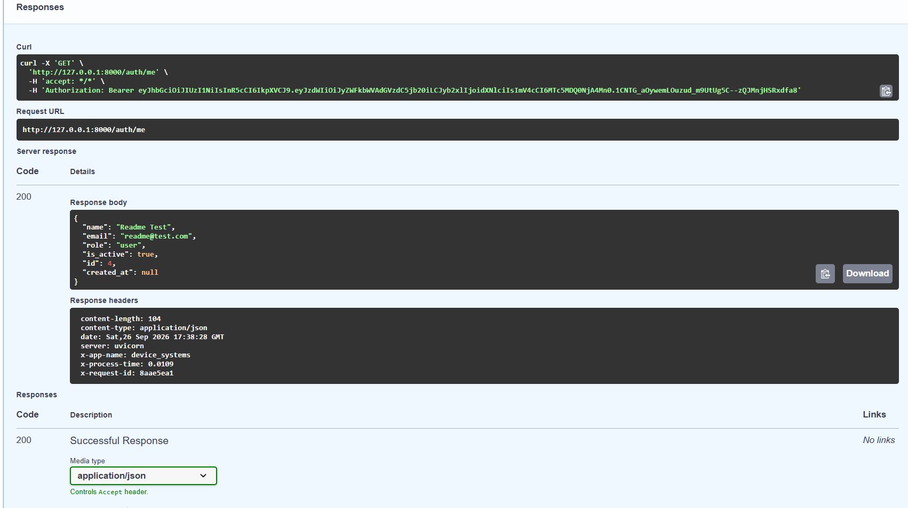
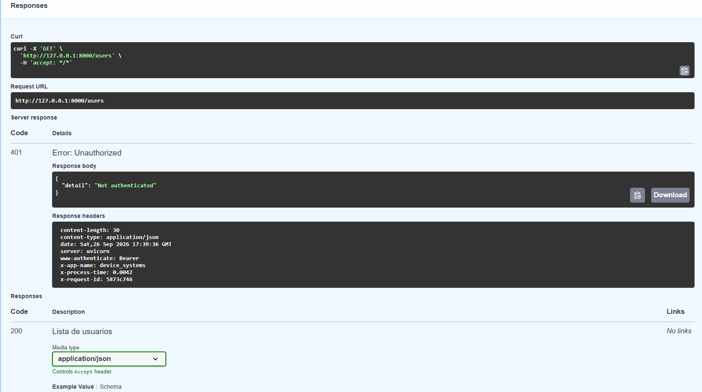
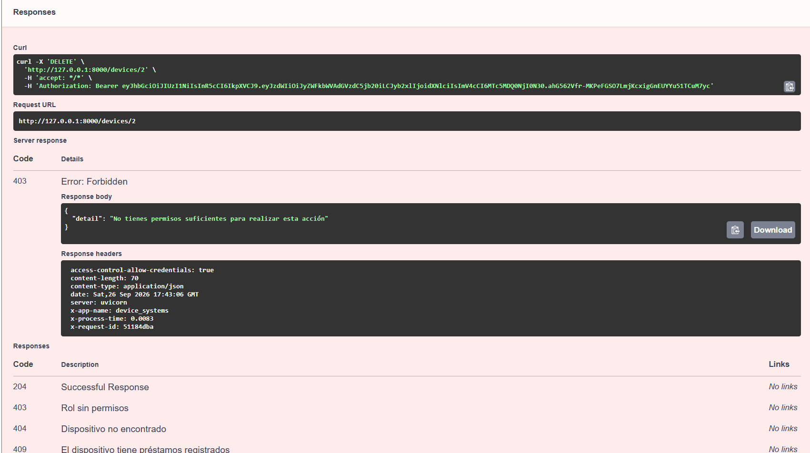
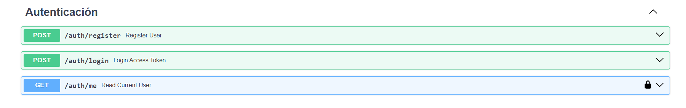
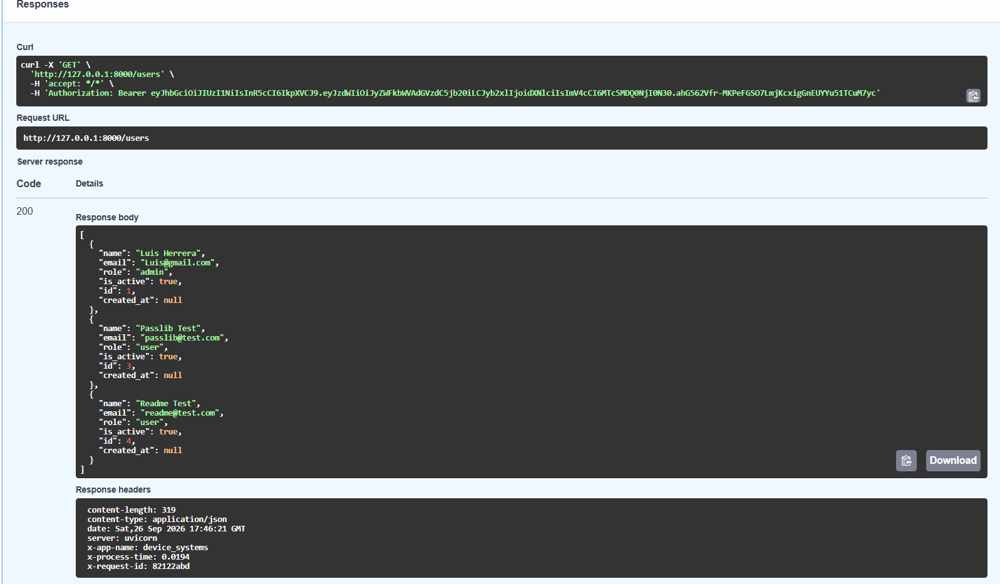
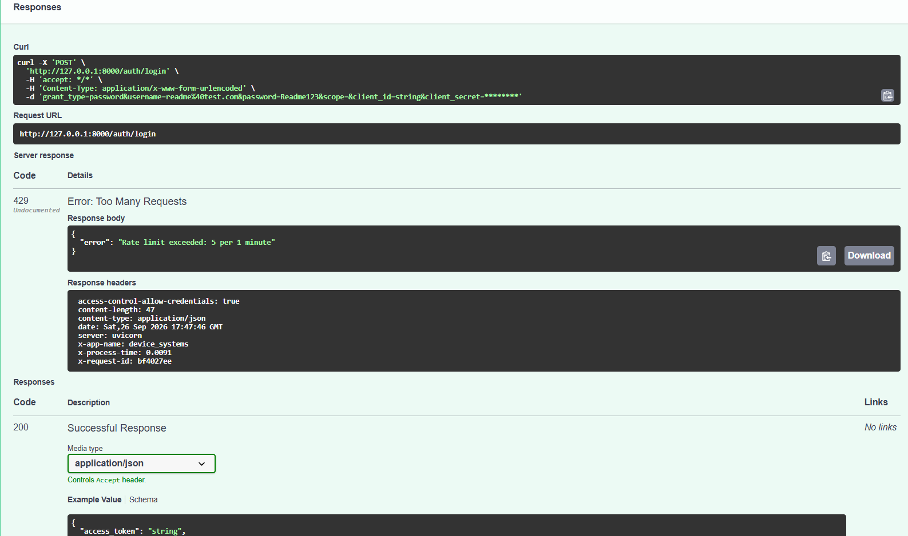

# device_systems - API REST v3.0.0

API REST evolutiva construida con FastAPI, SQLAlchemy y Alembic para la gestión de usuarios, dispositivos y préstamos, con una capa completa de seguridad: autenticación OAuth2/JWT, hash de contraseñas, protección de rutas por rol, CORS, middleware personalizado y rate limiting.

Actividad: **GA1-220501096-01-AA1-EV11 – FastAPI Seguridad: Autenticación, Middleware, CORS, Rate Limiting y Validación Avanzada en device_systems**

Rama de entrega: `device_systems_security`

---

## Estructura del proyecto

```
alembic/env.py
alembic/versions/0b63e4910253_make_hashed_password_not_nullable.py
alembic/versions/ba427333bff9_create_users_devices_and_loans_tables.py
alembic/versions/cb996ca9f839_add_hashed_password_to_users.py
app/__init__.py
app/auth/__init__.py
app/auth/dependencies.py
app/auth/security.py
app/core/__init__.py
app/core/limiter.py
app/database/__init__.py
app/database/connection.py
app/dependencies/__init__.py
app/dependencies/database_dependency.py
app/main.py
app/middlewares/__init__.py
app/middlewares/request_middleware.py
app/models/__init__.py
app/models/device_model.py
app/models/loan_model.py
app/models/user_model.py
app/routes/__init__.py
app/routes/auth_router.py
app/routes/device_routes.py
app/routes/loan_routes.py
app/routes/user_routes.py
app/schemas/__init__.py
app/schemas/auth_schema.py
app/schemas/device_schema.py
app/schemas/loan_schema.py
app/schemas/user_schema.py
app/services/__init__.py
app/services/device_service.py
app/services/loan_service.py
app/services/user_service.py
```


---

## Requisitos

- Python 3.13+
- uv (gestor de dependencias y entornos)
- SQLite (incluido, no requiere instalación aparte)

## Instalación

```bash
git clone <url-del-repositorio>
cd device_systems
git checkout device_systems_security
uv sync
```

## Variables de entorno

Copia `.env.example` a `.env` y define tu propia clave secreta:

```
SECRET_KEY=tu_clave_secreta_aqui
ALGORITHM=HS256
ACCESS_TOKEN_EXPIRE_MINUTES=30
```

`SECRET_KEY` nunca debe subirse al repositorio — `.env` está incluido en `.gitignore`. Puedes generar una clave aleatoria con:

```bash
python -c "import secrets; print(secrets.token_hex(32))"
```

## Migraciones de base de datos

Este proyecto evolucionó desde la actividad anterior (EV10) agregando campos de autenticación al modelo `User`. Para dejar la base de datos al día:

```bash
uv run alembic upgrade head
```



## Ejecutar el servidor

```bash
uv run uvicorn app.main:app --reload
```

Documentación interactiva disponible en: `http://127.0.0.1:8000/docs`

---

## Autenticación

La API implementa autenticación con **OAuth2 + JWT**. Los endpoints están bajo el prefijo `/auth`:

| Endpoint | Descripción |
|---|---|
| `POST /auth/register` | Registra un usuario nuevo con contraseña hasheada (bcrypt vía passlib) |
| `POST /auth/login` | Autentica al usuario y devuelve un token JWT (`access_token` + `token_type: bearer`) |
| `GET /auth/me` | Devuelve los datos del usuario autenticado a partir del token |

Roles soportados: `admin`, `support`, `user`.

Validaciones de contraseña en el registro (Pydantic v2, `field_validator`): mínimo 8 caracteres, al menos una mayúscula, una minúscula, un número, y sin espacios en blanco.





`[CAPTURA 04]` Consulta de `/auth/me` con el token autorizado (`200 OK`).


## Protección de rutas y roles

| Ruta | Protección requerida |
|---|---|
| `GET /users` | Usuario autenticado |
| `GET /users/{user_id}` | Usuario autenticado |
| `POST /devices` | Admin o support |
| `PUT /devices/{device_id}` | Admin o support |
| `PATCH /devices/{device_id}` | Admin o support |
| `DELETE /devices/{device_id}` | Admin |
| `POST /loans` | Usuario autenticado |
| `PATCH /loans/{loan_id}/return` | Admin o support |
| `GET /loans/details` | Admin o support |

Si el token no existe o es inválido, la API responde `401 Unauthorized`. Si el usuario no tiene el rol requerido, responde `403 Forbidden`. Además, `require_role` verifica que el usuario esté `is_active` antes de autorizar cualquier acción.

`[CAPTURA 05]` Acceso a ruta protegida sin token (`401 Unauthorized`).


`[CAPTURA 06]` Acceso con un rol sin permisos suficientes (`403 Forbidden`).


## Documentación Swagger / OpenAPI

La API expone metadatos completos (`title`, `description`, `version`) y organiza los endpoints por tags: Auth, Users, Devices, Loans, Root. El esquema de seguridad OAuth2 se ve reflejado en Swagger con el candado 🔒 en cada ruta protegida.

`[CAPTURA 07]` Swagger UI mostrando los endpoints de autenticación con el esquema OAuth2.


## CORS

Se configuró `CORSMiddleware` para permitir que un frontend en desarrollo consuma la API desde el navegador:

```python
origins = [
    "http://localhost:5173",
    "http://localhost:3000",
]

app.add_middleware(
    CORSMiddleware,
    allow_origins=origins,
    allow_credentials=True,
    allow_methods=["*"],
    allow_headers=["*"],
)
```

**¿Por qué no usar `"*"` en producción cuando hay credenciales?** El estándar CORS prohíbe combinar `allow_origins="*"` con `allow_credentials=True`: si un servidor permitiera cualquier origen y a la vez aceptara cookies o cabeceras de autorización, cualquier sitio malicioso podría hacer peticiones autenticadas a la API en nombre de un usuario sin su consentimiento (un ataque de tipo CSRF/cross-origin). Por eso `allow_origins` debe listar explícitamente los dominios de confianza que consumirán la API, y en producción esa lista debe limitarse a los dominios reales del frontend, nunca a un comodín.

## Middleware personalizado

Se implementó un middleware (`app/middlewares/request_middleware.py`) que:

- Mide el tiempo de respuesta de cada petición.
- Agrega la cabecera `X-Process-Time` con la duración.
- Agrega la cabecera fija `X-App-Name: device_systems`.
- Genera o propaga un `X-Request-ID` para trazabilidad.
- Registra en el log el método, la ruta y el código de estado de cada petición.

`[CAPTURA 08]` Respuesta HTTP mostrando las cabeceras `x-app-name`, `x-process-time` y `x-request-id`.


## Rate limiting

Se usó `slowapi` para limitar peticiones abusivas:

| Endpoint | Límite |
|---|---|
| `POST /auth/login` | 5 solicitudes por minuto |
| `POST /auth/register` | 3 solicitudes por minuto |
| `GET /users` | 30 solicitudes por minuto |
| `POST /loans` | 10 solicitudes por minuto |

Al superar el límite, la API responde `429 Too Many Requests`.

`[CAPTURA 09]` Prueba de rate limiting activado en `/auth/login` (`429 Too Many Requests`).


---

## Pruebas funcionales realizadas

| # | Caso de prueba | Resultado |
|---|---|---|
| 1 | Registro de usuario válido | `201 Created` |
| 2 | Registro con contraseña débil | `422 Unprocessable Entity` |
| 3 | Registro con email duplicado | `400 Bad Request` |
| 4 | Login correcto | `200 OK` + token JWT |
| 5 | Login con contraseña incorrecta | `401 Unauthorized` |
| 6 | Consulta de `/auth/me` | `200 OK` |
| 7 | Acceso a ruta protegida sin token | `401 Unauthorized` |
| 8 | Acceso con token inválido | `401 Unauthorized` |
| 9 | Acceso con usuario sin permisos | `403 Forbidden` |
| 10 | Creación de dispositivo con rol permitido (admin) | `201 Created` |
| 11 | Eliminación de dispositivo con rol no permitido | `403 Forbidden` |
| 12 | Configuración CORS | Ver sección CORS arriba |
| 13 | Cabeceras generadas por middleware | Confirmadas (`x-app-name`, `x-process-time`, `x-request-id`) |
| 14 | Activación de rate limiting | `429 Too Many Requests` |
| 15 | Verificación de Swagger/OpenAPI | Confirmado, endpoints documentados y protegidos |

---

## Reflexión final sobre la importancia de la seguridad en APIs REST

Antes de esta actividad, veía la seguridad de una API como un detalle secundario. Después de implementar autenticación JWT, roles y protección de rutas en device_systems, entendí que sin esa capa cualquiera podría leer, crear o borrar datos libremente. También aprendí que el hash de contraseñas no es opcional ni siquiera en un proyecto académico, y tuve que resolver un problema real de compatibilidad entre `bcrypt` y `passlib` que me enseñó a no confiar en errores silenciosos sin investigarlos a fondo.

El middleware personalizado y el rate limiting me mostraron su utilidad práctica: el primero ayuda a monitorear y depurar problemas, y el segundo protege contra ataques de fuerza bruta al login. Si llevara esta API a producción real, agregaría rotación de tokens, revocación de sesiones y pruebas automatizadas.