# Device Systems API - FastAPI & SQLAlchemy

- Sistema backend profesional de gestión de inventario y préstamos de dispositivos tecnológicos desarrollado con **FastAPI**, **SQLAlchemy**, **Alembic**, **SQLite** y **Pydantic**. Este proyecto implementa validaciones estrictas, control de relaciones de bases de datos y un manejo robusto de excepciones y códigos de estado HTTP.

- Tecnologías y Librerías Utilizadas

Python

FastAPI

SQLAlchemy (ORM)

Alembic (Migraciones de base de datos)

Pydantic (Validación de esquemas de datos)

SQLite (Base de datos relacional)

Uvicorn (Servidor ASGI)

- Estructura del Proyecto

''device_systems/
│
├── alembic/              # Migraciones de base de datos
├── app/
│   ├── models/           # Modelos SQLAlchemy (User, Device, Loan)
│   ├── schemas/          # Esquemas Pydantic y validaciones
│   ├── routers/          # Endpoints de la API (Users, Devices, Loans)
│   └── database.py       # Configuración de la sesión de BD
│
├── alembic.ini           # Configuración de Alembic
├── main.py               # Punto de entrada de FastAPI
└── requirements.txt      # Dependencias del proyecto''

- Instalación y Configuración Local
1. Clona el repositorio e ingresa al directorio del proyecto.
2. Crea y activa un entorno virtual:
python -m venv venv
# En Windows:
venv\Scripts\activate
3. Instala las dependencias:
pip install -r requirements.txt
4. Ejecuta las migraciones de Alembic para inicializar la base de datos:
alembic upgrade head
5. Inicia el servidor de desarrollo con Uvicorn:
uvicorn main:app --reload

- Documentación Interactiva (Swagger UI / ReDoc)
Una vez iniciado el servidor, puedes acceder a la documentación interactiva en el navegador:

Swagger UI: http://127.0.0.1:8000/docs
ReDoc: http://127.0.0.1:8000/redoc

- Evidencias de Pruebas Funcionales y Migraciones (Swagger UI)
A continuación se registra la ejecución, historial y validación completa de todas las evidencias del sistema:

1. Control de Versiones y Migraciones (Alembic)
Inicialización de Alembic: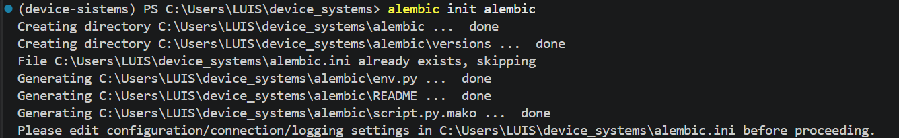

Creación de Revisión: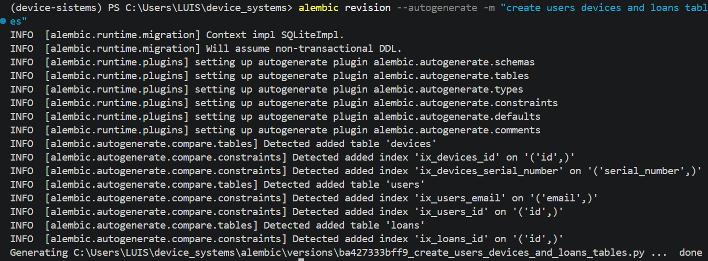

Aplicación de Migraciones (upgrade head):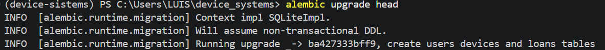

Historial de Migraciones: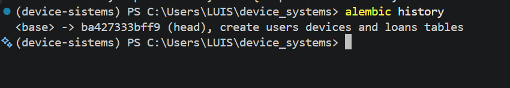

2. Documentación y Vistas Generales
Endpoints en Swagger UI: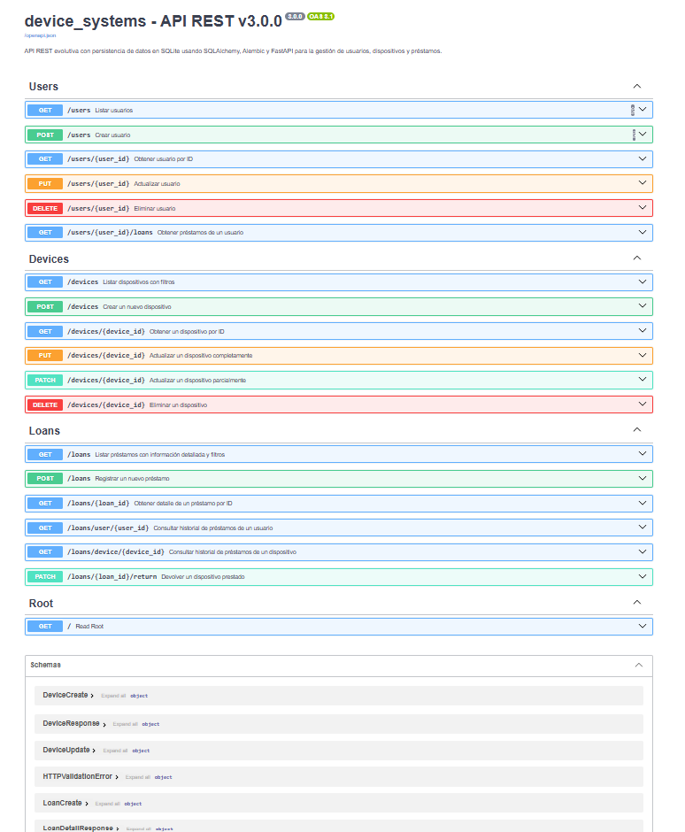

Tablas Generadas en Base de Datos: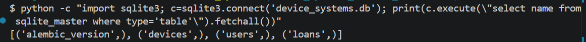

Documentación en ReDoc: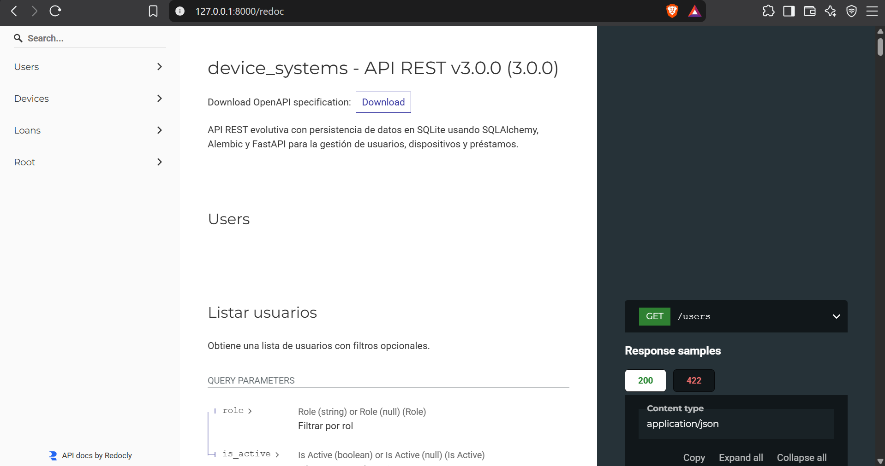

Validación de Errores de Pydantic / Estado (422):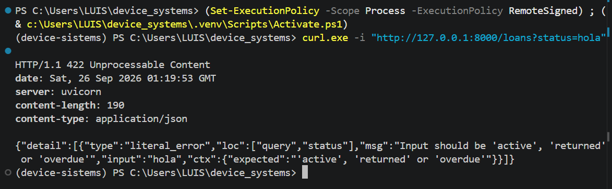

3. Endpoints de Usuarios y Dispositivos
Endpoints de Dispositivos y Préstamos: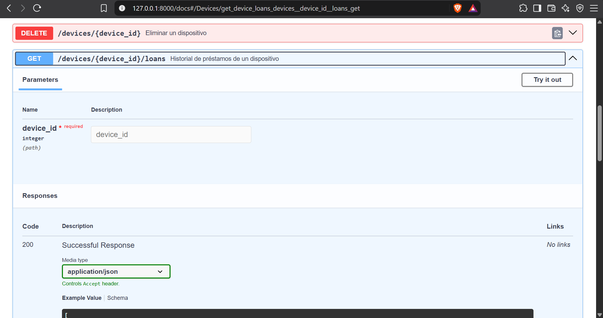

Detalles y Consultas de Préstamos: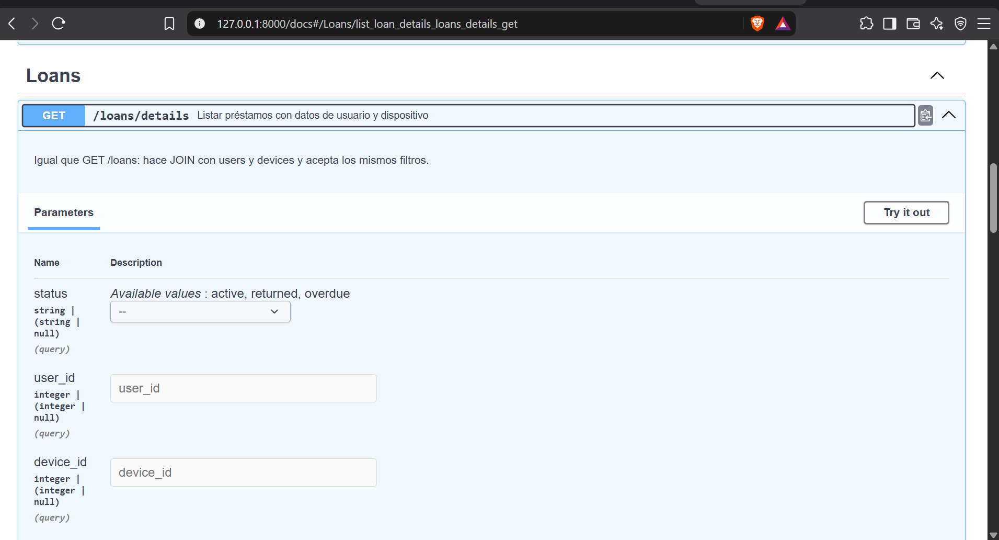

Creación de Usuario (POST /users):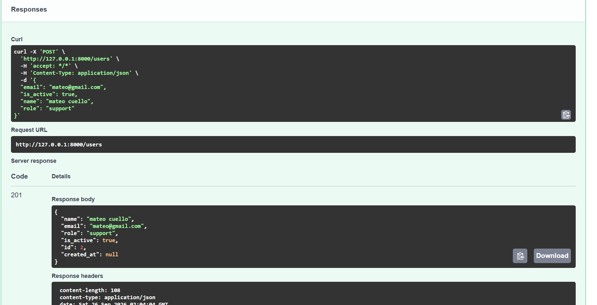

Creación de Dispositivo (POST /devices):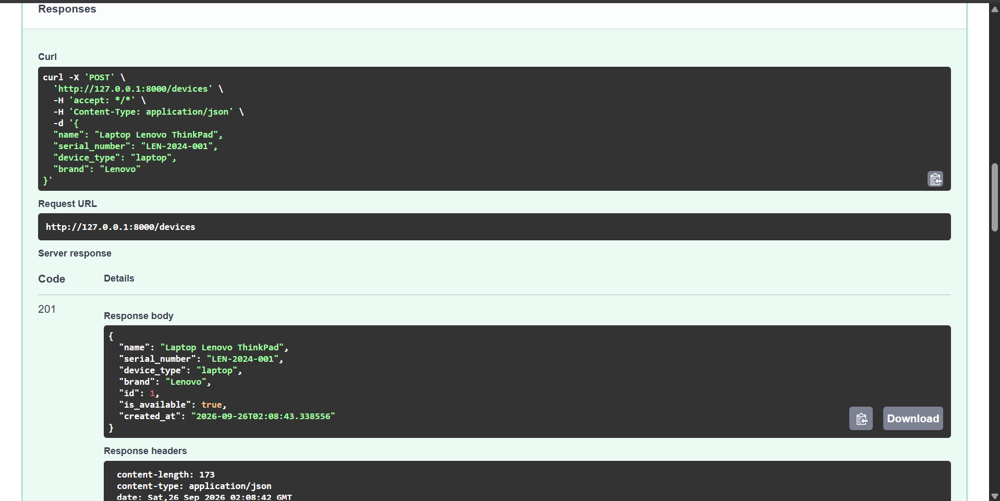

4. Gestión y Lógica de Préstamos
Creación de Préstamo (POST /loans):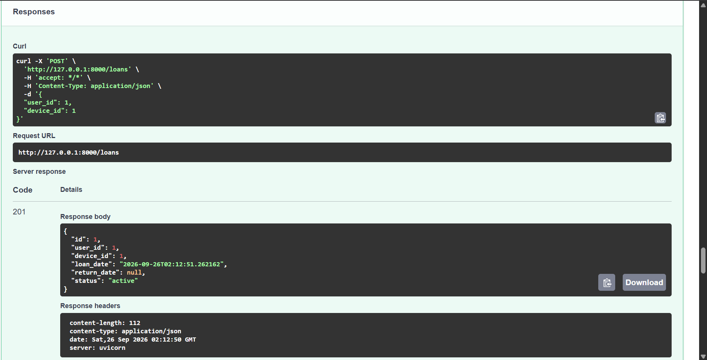

Validación de Conflicto - Dispositivo No Disponible (409 Conflict):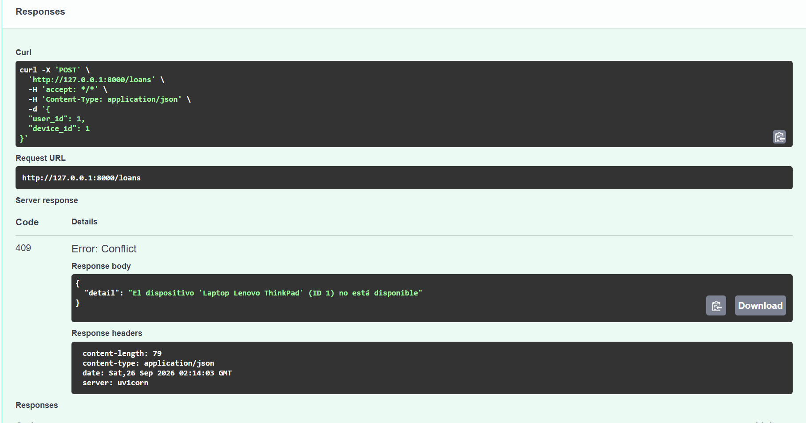

Listado General de Préstamos (GET /loans):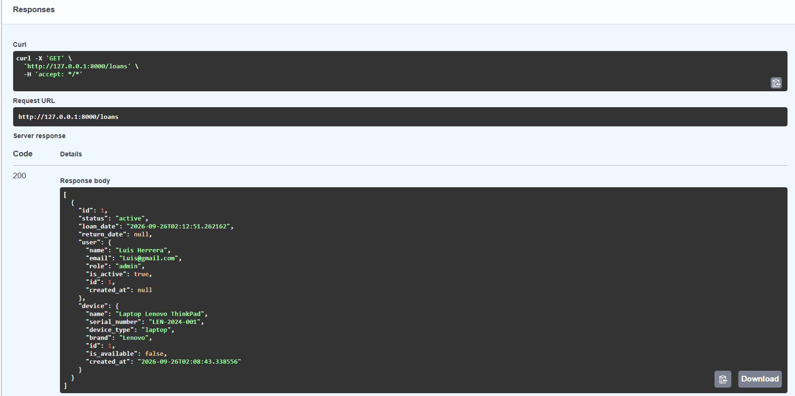

Devolución de Dispositivo (PATCH /loans/{id}/return):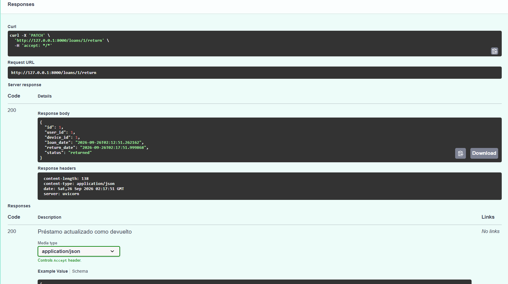

Filtrado por Estado (GET /loans?status=returned):

Consulta de Préstamo por ID (GET /loans/{id}):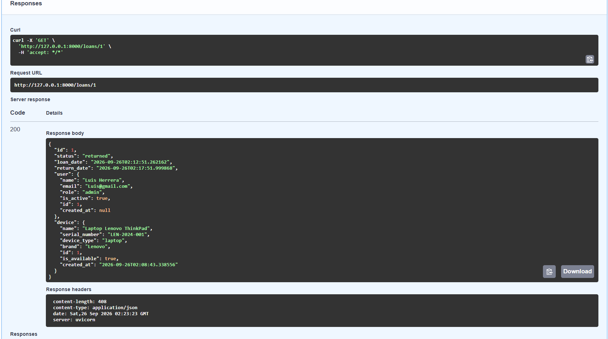

Historial por Usuario (GET /loans/user/{id}):

Historial por Dispositivo (GET /loans/device/{id}):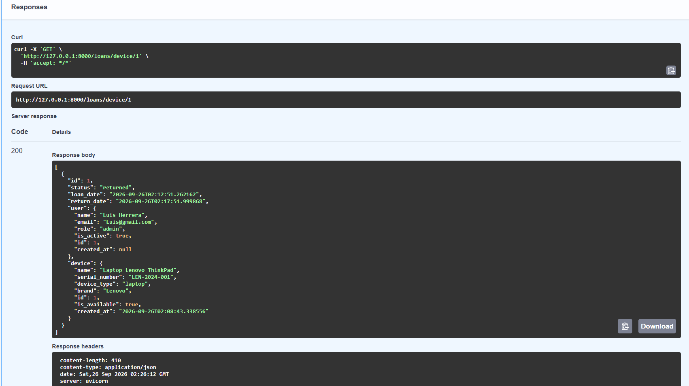

5. Manejo de Errores
Recurso No Encontrado (404 Not Found):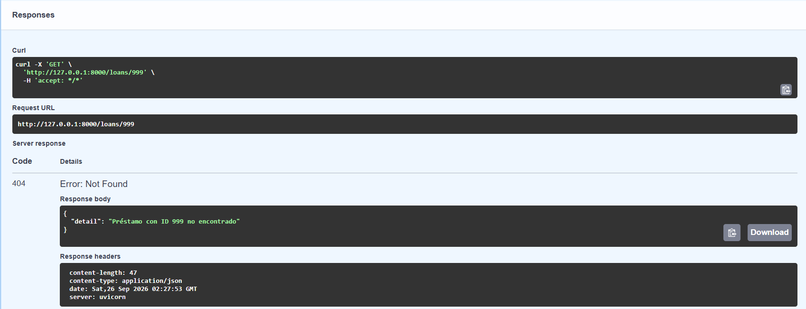
